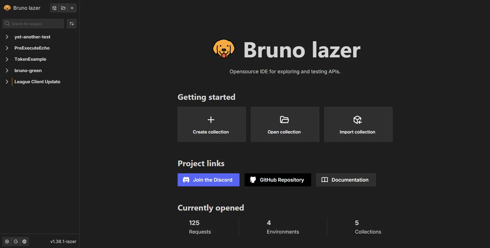
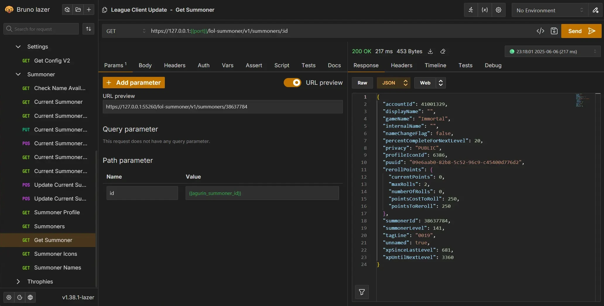

 

### Bruno Lazer - Lightweight client for testing and documenting API's

Forked from [usebruno/bruno](https://github.com/usebruno/bruno).

Bruno Lazer is a fork of Bruno, the innovative API client aimed at revolutionizing the status quo represented by Postman and similar tools.

Collections are stored directly in a folder on your filesystem. It uses a plain text markup language called "Bru" to save information about API requests. You can use Git or any version control system of your choice to collaborate on your API collections.

Bruno Lazer was forked from Bruno to implement bug fixes, performance improvements, and new features without having to wait for long approval and release times.

Lazer has implemented improvements like:

- Removing telemetry and making the app actually fully offline ([#377](https://github.com/usebruno/bruno/issues/337))
- Replacing CodeMirror with Monaco for a better editing experience ([#1450](https://github.com/usebruno/bruno/pull/1450))
- Many performance improvements, request history, and more

### Download Bruno Lazer

Bruno Lazer is currently only available as a nightly build. You can download it from the [GitHub Release Page](https://github.com/Its-treason/bruno/releases/tag/nightly).

Daily builds allow Bruno Lazer to make quick code iterations and deliver bug fixes on a daily basis.

### Screenshots

> Bruno Lazer's landing page

> Example request to the "League Client API"

### Contribute

Thank you for considering contributing. All contributions are very helpful to improve Lazer.

If you want to fix a bug or implement a new feature, be sure to use TypeScript for new code, format your code with Prettier, and open pull requests early to get feedback.

Even if you are not able to make contributions via code, please don't hesitate to file bugs and feature requests that need to be implemented to solve your use case.

### Contributors

    

